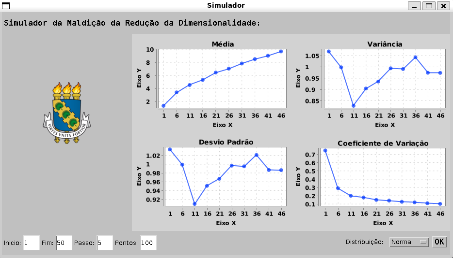

# Trabalho Final - Técnicas de Programação [CK0235]
Universidade Federal do Ceará / Federal University of Ceará
## Introdução / Introduction
---

[PT] Esse trabalho final visa avaliar os estudantes no paradigma de **Programação Orientada à Objetos**, **padrões de Projeto** e **trabalho em equipe**.

[EN] This work aims to evaluate the students on the **Object Oriented Programming** paradigm, **Design Patterns** and **Team Working**.  
## Linguagem / Language
---
[PT] O sistema é feito inteiramente na linguagem de programação Java.

[EN] The system is made entirely in the Java programming language.
## Tema / Subject
---
[PT] O tema escolhido para esse projeto é:
> Simulador do problema "Curse of Dimensionality" 

"O problema relacionado com a maldição da dimensionalidade (“curse of dimensionality”) se refere aos vários fenômenos que ocorrem quando analisamos ou organizamos dados em espaços de alta-dimensionalidade (frequentemente com mais de 10 de dimensões envolvidas), fato que não ocorre em baixa dimensões. Este problema foi cunhado por Richard Bellman quando considerou problema em otimização dinâmica. Mais detalhes sobre este problema podem ser encontrado em https://en.wikipedia.org/wiki/Curse_of_dimensionality. Desta forma, o objetivo deste sistema é simular este problema mostrando, por exemplo, a distorção que ocorre quando usamos funções de distância (e.g. distância euclidiana) em alta-dimensionalidade. De fato, a alta dimensionalidade torna as distâncias entre dois elementos de um conjunto muito semelhantes, dificultando distingui-los. O programa deve fazer uso de gráficos e simular o crescimento da dimensionalidade para demonstrar a variância, desvio padrão e média das distâncias calculadas. 
"

[EN] The chosen subject of this project is:
> Curse of Dimensionality problem Simulator

"The Curse of Dimensionality related problem refers to various phenomenon that occur when we analyze or organize data in high-dimension spaces (frequently with more than 10 involved dimensions), issue that doesn't occur in lower dimensions. This problem was named by Richard Bellman when he considered this problem in dynamic optimizations. More details about this problem can be found in https://en.wikipedia.org/wiki/Curse_of_dimensionality. Therefore, the objective of this system is to simulate this problem, showing, for instance, the distortion that occurs when we use distance functions (e.g. euclidian distance) in higher dimensions. In fact, higher dimensions turn the distances between two elements of a set too similar, difficulting to distinguish them. The program must use charts and simulate the dimensionality growth to demonstrate the variance, the standard deviation and the mean of those calculated distances."

## Avaliação / Evaluation
---

[PT] O projeto final será avaliado através da apresentação oral do trabalho e da entrega dos códigos fontes produzidos. A apresentação oral possuirá peso 6 e a análise dos códigos fontes, peso 4. 

Os códigos fontes serão avaliados de acordo com os seguintes critérios:

(3,0 pontos) Uso padrão de projeto MVC  
(2,0 pontos) Código documentado  
(5,0 pontos) Lista de funcionalidades implementadas  

[EN] The project will be evaluated by an oral presentation about the system and by the assignment of the source code. The oral presentation will represent 60% of the final grade, while the source code will represent 40%.

The source code will be evaluated by the following criteria:

(3.0 points) MVC Design Pattern usage  
(2.0 points) Code well documented  
(5.0 points) List of functionalities implemented.  

## Participantes / Participants
---
| Estudante / Student | Github |
| --- | --- |
| Diego Rabelo | [rabdiego](https://github.com/rabdiego )
| Gabriel Carmo | [ArtroxGabriel](https://github.com/ArtroxGabriel)
| Lucas Lópes | [LucasSLopes](https://github.com/LucasSLopes)
| Ramon Nícolas | [R4m0nN1col4s](https://github.com/R4m0nN1col4s)
| Tobias Nóbrega | [Tobnobre](https://github.com/Tobnobre)

## Uso / Usage
---
[PT] **Importante: primeiro, mude no código Gui.java a seção da imagem para o seu path absoluto (só funciona assim). Também recomendamos usar o VSCode com as extensões padrões de java e o runcodes, para assim começar um projeto na pasta Final e utilizar o arquivo .jar do xchart nas bibliotecas referenciadas** Na tela, há algumas entradas a serem preenchidas abaixo, sendo estas a dimensão de início, dimensão final, passo, número de pontos e distribuição. O simulador gerará para várias dimensões (dimensão de início, dimensão de início + passo, dimensão de início + 2*passo, ..., dimensão final) um número de pontos, estes aleatórios seguindo a distribuição escolhida, e calculará a média, variância, desvio padrão e coeficiente de variação das distâncias entre estes pontos. O programa mostrará gráficos relacionados à essas métricas. O objetivo é ver como o aumento de dimensionalidade afeta essas distâncias, tendendo a aumentar e ficarem mais homogêneas.

[EN] **Important: first, change in the code Gui.java the section about the image to your absolute path (It only works in that way). We also recommend to use VSCode with the standard extensions of java and runcodes, to then start a new project in the folder Final, and use the xchart .jar file in the referenced libraries** On the screen, there are inputs to be filled by the user below, being the starting dimension, ending dimension, step, number of points and distribution. The simulator will generate to various dimensions (starting dimension, starting dimension + step, starting dimension +2*step, ..., ending_dimension) a number of points, those being random, following the chosen distribution, and will calculate the mean, variance, standard deviation and variance coefficient of the distances between those points. The program will show charts about these metrics. The objective is see how the increment in dimensionality affect these distances, making them getting bigger and more homogeneous.